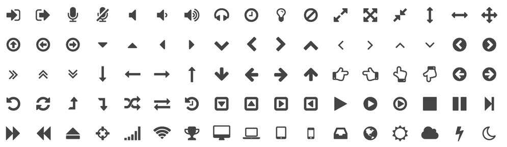
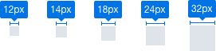

# 图标 Icon

* * *

## 图标库

[http://fontello.com/](http://fontello.com/)

## 图标尺寸

图标尺寸与字号对应，12px字号对应12px图标，以此内推，文字与图标之间的间距为8px。

## 图标命名规则

统一的命名方式有助于管理图标，也能更快速的找到需要的图标。运用「 场景+功能 」的「 驼峰命名法 」。例如：通用的下拉菜单的 “ ▼ ” 图标命名为 GeneralDropDownTriangle。

## 关键轮廓线

根据不同的图标形状类型使用不同的轮廓线，可以使图标之间保持一致的视觉效果。

