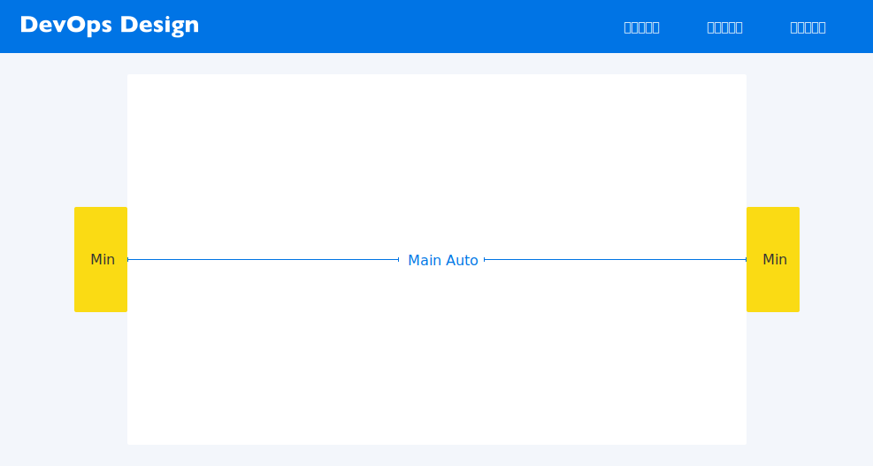
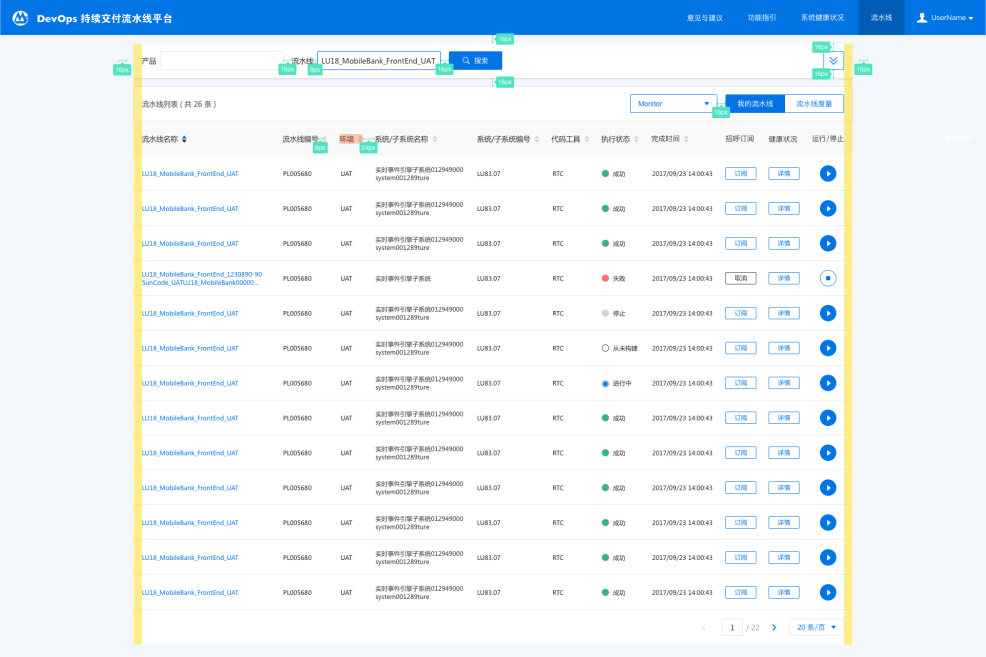
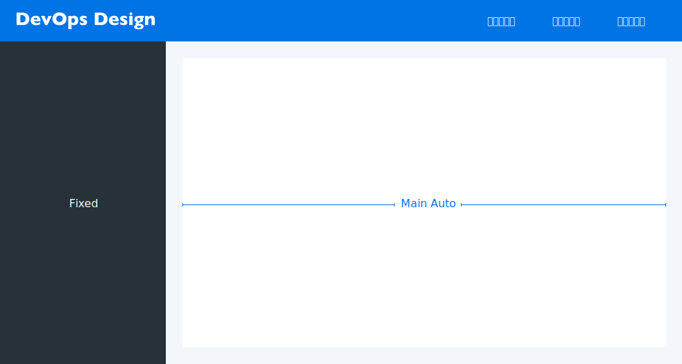
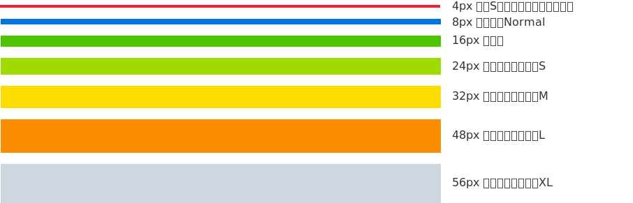
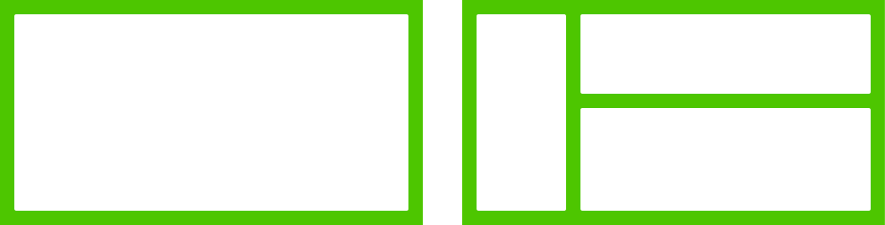
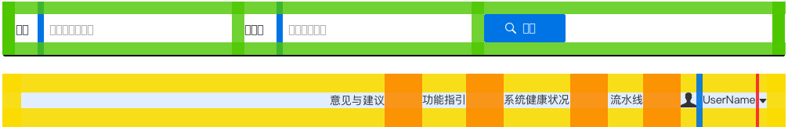

# 布局 Layout

* * *

## 上下布局

简洁明快，干扰信息少。随两边留白区域进行最小值的定义，当留白区域到达限定值之后再对中间的主内容区域进行动态缩放。

## 左右布局

「 T字型布局 」页面结构清晰，主次分明,左侧导航可扩展性强.。常见的做法是将左边的导航栏固定，对右边的工作区域进行动态缩放。

## 标准内边距

间距：y=8+8*n （n>=0）在 Web 设计中，元素之间的距离，组件或区块的内边距，都需要按照七级网格来进行定位

## 栏

栏与栏之间的外部间距为 16px，勿使用其它间距。

## 模块

由元素/组件/其他模块构成。

## 韵律

* 整齐：整齐的段落和文字，会使用户获得良好的阅读体验，增强信息获取效率。
* 一致：重复项中的元素安排要一致，凌乱的元素将会扰乱用户的操作感知。
* 主次与节奏：主次分明的内容安排，大大加强了获取有效信息的效率，同时，重复项中的可变元素布局安排应该恰到好处，让整体产生规律的节奏感。
